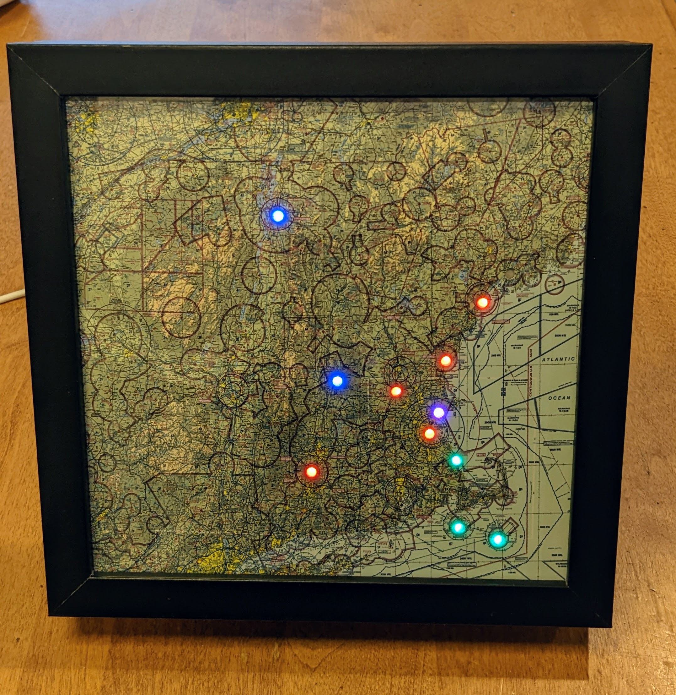

# LilVfrMap

**Lil' VFR Map**

A simple to build 8x8 VFR/IFR Map using CircuitPython, ESP32, and Neopixels.

## Major Parts List

| Part | Source | Cost  | Comment |
|------|--------|-------|---------|
| ESP32-S2 Mini | [Amazon](https://www.amazon.com/HiLetgo-ESP32-S2FN4R2-ESP32-S2-Type-C-Connect/dp/B0B291LZ99/ref=sr_1_1_sspa?crid=2QS3FHPHFBYJ7&keywords=HiLetgo+ESP32+S2&qid=1662392955&s=electronics&sprefix=hiletgo+esp32+s2%2Celectronics%2C75&sr=1-1-spons&psc=1) | ~$6 | Ordered a 3 pack to build maps for friends and the size was right. Note: If you're new to CircuitPython, you should instead buy parts from Adafruit! Without Adafruit, none of this would be so easy! This is probably all you need [ESP32 S2 QT Py](https://www.adafruit.com/product/5325).
| Neopixels (WS2812B) | [Amazon](https://www.amazon.com/BTF-LIGHTING-WS2812B-Heatsink-10mm3mm-WS2811/dp/B01DC0J3UM/ref=sr_1_9?keywords=WS2812B&qid=1662393496&sr=8-9) | ~$2 | 100 LEDs, plenty for future projects!
| 8x8 Picture Frame | [Amazon](https://www.amazon.com/gp/product/B07M84BPJM/ref=ppx_yo_dt_b_search_asin_title?ie=UTF8&psc=1) | ~$14 | 
| 8x8 Photo of Map | I printed thru CVS | ~$4 | Printed with a matte finish which I think looks nice

## Additional Parts

| Part | Source | Cost  | Comment |
|------|--------|-------|---------|
| Screw Hole Punch | [Amazon](https://www.amazon.com/gp/product/B08VH5RLS6/ref=ppx_yo_dt_b_asin_title_o04_s01?ie=UTF8&psc=1) | ~$16 | Make perfect holes in your picture
| Vellum Paper | Recycle something! | $0 | You want something to diffuse the LEDs

## Build Instructions

1. Install CircuitPython on the ESP32 Boards
1. Create a `secrets.py` with your WIFI info and go create a free account on https://www.checkwxapi.com/. (You need to get an API key)
1. Select the stations you want to monitor
1. Create an 8x8 photo for the frame ([example](./resources/map.png)) I put mine together with FAA maps available online (https://www.faa.gov/air_traffic/flight_info/aeronav/productcatalog/vfrcharts/)
1. Solder the neopixels in an easy to wire order (shortest distance isn't always easiest!)
1. Punch out the airport locations
1. Put it all together